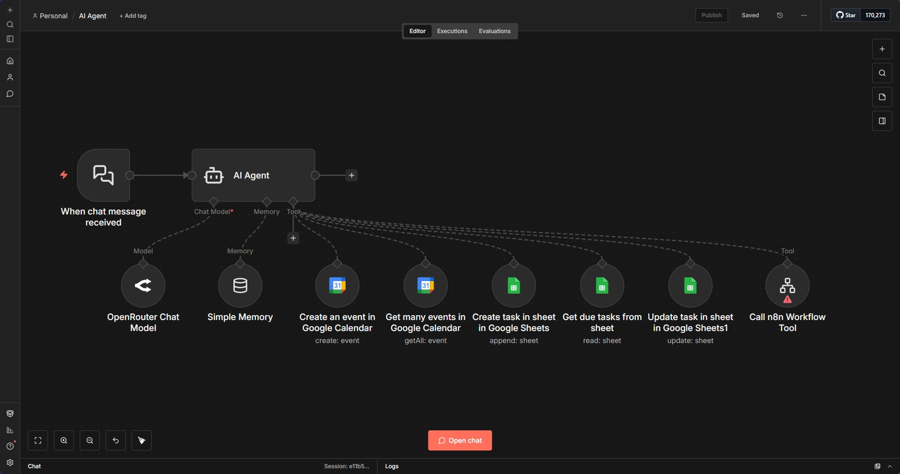

# AI Task & Calendar Manager



## 📋 Overview

An intelligent AI agent powered by GPT that manages your tasks and calendar through natural language conversations. Simply chat with the agent to create, search, update calendar events, and manage tasks in Google Sheets - no complex commands needed.

## ✨ Features

- **🤖 AI-Powered Interface** - Natural language conversation with GPT model
- **📅 Calendar Management** - Create and search Google Calendar events
- **📝 Task Tracking** - Create, update, and search tasks in Google Sheets
- **🧠 Memory Context** - Remembers conversation history for context
- **🔧 Multi-Tool Integration** - Coordinates multiple Google services
- **📊 Smart Updates** - Searches before updating to find correct records
- **🎯 Priority Management** - Handles task priorities (Low, Medium, High)
- **📆 Date Intelligence** - Understands date formats and time ranges

## 🔧 How It Works

```
User Chat Message
    ↓
AI Agent (GPT Model)
    ↓
Determines Required Action(s):
    ├── Create Calendar Event
    ├── Search Calendar Events  
    ├── Create Task in Sheets
    ├── Search Tasks in Sheets
    └── Update Task in Sheets
    ↓
Executes Tools & Returns Response
```

## 🛠️ Technologies Used

- **n8n** - Workflow orchestration
- **LangChain** - AI agent framework
- **OpenRouter** - GPT model access (gpt-oss-120b)
- **Google Calendar API** - Event management
- **Google Sheets API** - Task database
- **Memory Buffer** - Conversation context

## 🗣️ Example Conversations

**Creating a Calendar Event:**
```
You: Schedule a team meeting for tomorrow at 2 PM for 1 hour
AI: I've created a calendar event "Team Meeting" for tomorrow 
    from 2:00 PM to 3:00 PM in your calendar.
```

**Creating a Task:**
```
You: Add a task to finish the quarterly report by Friday, high priority
AI: I've added the task "Finish quarterly report" with a due date 
    of 22/01/2026 and set the priority to High.
```

**Searching Calendar:**
```
You: What meetings do I have next week?
AI: Here are your meetings next week:
    - Team Sync on Monday at 10 AM
    - Client Call on Wednesday at 3 PM
    - Project Review on Friday at 2 PM
```

**Updating a Task:**
```
You: Change the quarterly report task priority to medium
AI: I found the task and updated the priority to Medium.
```

## 📦 Setup Instructions

### Prerequisites
- n8n instance with AI node support
- Google account (Calendar + Sheets access)
- OpenRouter API key (or other LLM provider)
- Google Sheets for task tracking

### Google Sheets Schema
Create a sheet with these columns:
```
Task Name | Description | Due Date | Priority
```

### Installation

1. **Import the Workflow**
   ```bash
   # Import AI_Task_Calendar_Manager.json into n8n
   ```

2. **Set Up LLM Provider**
   - Get API key from [OpenRouter](https://openrouter.ai/)
   - Add OpenRouter credentials in n8n
   - Or replace with OpenAI/Anthropic if preferred

3. **Configure Google Calendar**
   - Add Google Calendar OAuth2 credentials
   - Select or create a calendar for the agent to use
   - Update calendar ID in all Calendar nodes

4. **Configure Google Sheets**
   - Create task tracking sheet with schema above
   - Copy sheet ID from URL
   - Update `documentId` in all Sheets nodes
   - Add Google Sheets OAuth2 credentials

5. **Customize System Prompt** (Optional)
   - Modify AI Agent node's system message
   - Adjust date format preferences
   - Add custom instructions or rules

6. **Test the Agent**
   - Open the chat interface in n8n
   - Try creating a test event: "Schedule lunch tomorrow at noon"
   - Try creating a test task: "Remind me to call John by Friday"
   - Verify entries appear in Calendar and Sheets

7. **Deploy**
   - Activate the workflow
   - Access via n8n chat interface or embed in your app

## 🎓 What I Learned

- **AI Agent Architecture**: Building conversational AI with tool capabilities
- **LangChain Integration**: Connecting LLMs with external tools and APIs
- **Natural Language Processing**: Extracting structured data from user messages
- **Tool Calling**: Enabling AI to decide which tools to use and when
- **Memory Management**: Maintaining conversation context across messages
- **Prompt Engineering**: Writing effective system prompts for AI agents
- **Multi-API Orchestration**: Coordinating Google Calendar and Sheets
- **Error Recovery**: Implementing search-before-update patterns

## 🔄 Workflow Components

### Core Nodes
| Node | Purpose |
|------|---------|
| When chat message received | Accepts user messages via chat interface |
| AI Agent | Main orchestrator - decides which tools to call |
| OpenRouter Chat Model | GPT language model for understanding and generation |
| Simple Memory | Stores conversation history for context |

### Tool Nodes
| Tool | Capabilities |
|------|-------------|
| Create Event (Calendar) | Adds new calendar events with title, start, end times |
| Get Events (Calendar) | Searches calendar within date ranges |
| Create Task (Sheets) | Adds new tasks with name, description, due date, priority |
| Search Tasks (Sheets) | Finds tasks by due date |
| Update Task (Sheets) | Modifies existing task properties |

## 🧠 System Prompt Breakdown

The AI agent follows these instructions:

```
1. Current date awareness - Knows today's date for relative references
2. Date formatting - Uses dd/mm/yyyy format consistently
3. Search-first pattern - Always searches before updating records
4. Tool selection logic - Chooses appropriate tools for user requests
5. Error handling - Gracefully handles edge cases
```

## 📝 Use Cases

This workflow is ideal for:
- **Personal Productivity** - Managing daily tasks and appointments
- **Small Teams** - Collaborative task and calendar management
- **Executive Assistants** - AI-powered scheduling assistant
- **Project Managers** - Quick task creation and deadline tracking
- **Freelancers** - Client meeting and deliverable management
- **Students** - Assignment and exam schedule tracking

## 🎯 Supported Commands

### Calendar Operations
- "Schedule [event] for [date/time]"
- "What's on my calendar [date range]?"
- "Do I have any meetings tomorrow?"
- "Add a meeting with [person] on [date]"

### Task Operations
- "Add task: [description]"
- "Create a [priority] priority task for [description]"
- "What tasks are due [date]?"
- "Update [task name] to [new details]"
- "Change priority of [task] to [priority]"

## 🤔 Common Issues & Solutions

**Problem:** AI doesn't understand date references
- **Solution:** Update system prompt with clearer date handling instructions

**Problem:** Tool calls failing
- **Solution:** Verify all Google API credentials are valid and authorized

**Problem:** Updates not working
- **Solution:** Ensure search tools are configured correctly and agent is instructed to search first

**Problem:** Memory not persisting
- **Solution:** Check that Memory Buffer node is properly connected to AI Agent

**Problem:** Wrong calendar/sheet being accessed
- **Solution:** Double-check all document/calendar IDs in tool nodes

## 💡 Advanced Tips

1. **Batch Operations**: "Create 5 tasks for this project..."
2. **Context Chaining**: Reference previous messages ("Update that task to tomorrow")
3. **Complex Queries**: "Find all high priority tasks due this week"
4. **Multi-Step**: "Schedule a meeting and create a prep task for it"

## 🔒 Security Considerations

- OAuth tokens have limited scopes
- Agent can only access specified calendar and sheets
- Consider implementing user authentication for multi-user deployments
- Review system prompt to prevent prompt injection attacks
- Limit agent's capabilities to necessary operations only

## 📊 Performance Notes

- **Response Time**: 2-5 seconds depending on tool complexity
- **Token Usage**: ~100-500 tokens per interaction
- **Rate Limits**: Subject to OpenRouter and Google API limits
- **Concurrency**: Can handle multiple chats if deployed properly

## 🔗 Integration Examples

**Extend this agent with:**
- Todoist/Asana integration for advanced task management
- Email parsing to create tasks from messages
- Slack bot interface for team access
- Mobile app integration via n8n webhooks
- Notion/Obsidian sync for documentation

## 📄 License

This project is open source and available for learning purposes.

