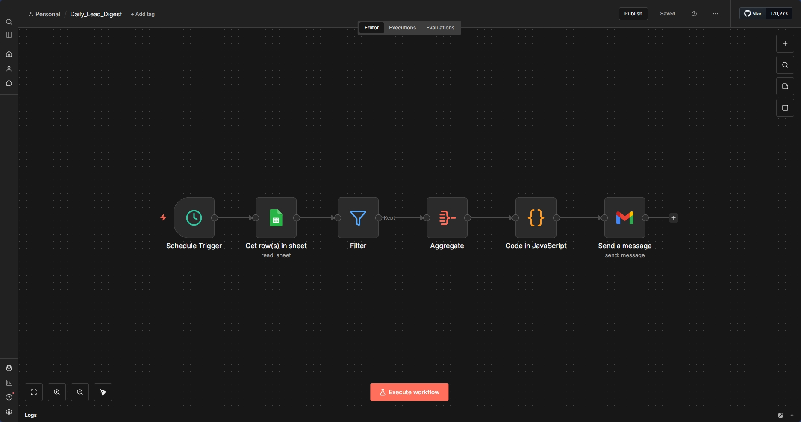

# Daily Lead Digest



## 📋 Overview

An automated daily report system that queries Google Sheets for today's leads, filters out rejected and already-contacted prospects, and sends a formatted summary email to the sales team. This workflow runs on a schedule and helps teams stay on top of new opportunities.

## ✨ Features

- **⏰ Scheduled Execution** - Runs automatically every day at 7 PM
- **📊 Google Sheets Integration** - Queries lead database with date filters
- **🔍 Smart Filtering** - Excludes rejected leads and those already called
- **📧 Formatted Digest** - Sends clean, readable email summaries
- **💾 Data Aggregation** - Consolidates multiple leads into single report
- **🔧 Custom Formatting** - Uses JavaScript to structure email content

## 🔧 How It Works

```
Schedule Trigger (Daily at 7 PM)
    ↓
Query Google Sheets (Filter: Date = Today)
    ↓
Filter (Called = FALSE AND Rejected = FALSE)
    ↓
Aggregate All Data
    ↓
Format with JavaScript
    ↓
Send Email Summary
```

## 🛠️ Technologies Used

- **n8n** - Workflow automation
- **Google Sheets** - Lead database
- **Gmail** - Email delivery
- **JavaScript** - Data formatting
- **Cron Scheduling** - Time-based triggers

## 📦 Setup Instructions

### Prerequisites
- n8n instance
- Google account with Sheets and Gmail access
- Google Sheet with lead data (see schema below)

### Google Sheets Schema
Your sheet should have these columns:
```
First Name | Last Name | Email | Budget | Message | Date | Called | Rejected
```

### Installation

1. **Import the Workflow**
   ```bash
   # Import Daily_Lead_Digest.json into n8n
   ```

2. **Configure Google Sheets**
   - Create or use existing lead tracking sheet
   - Copy the sheet ID from URL
   - Update the `documentId` in "Get row(s) in sheet" node
   - Ensure columns match the schema above

3. **Set Up Credentials**
   - Add Google Sheets OAuth2 credentials
   - Add Gmail OAuth2 credentials
   - Authorize both services

4. **Update Email Recipients**
   - In "Send a message" node, replace `okpor.david@gmail.com` with your sales team email
   - Or use a distribution list for multiple recipients

5. **Adjust Schedule** (Optional)
   - Default: Daily at 7 PM (19:00)
   - Click "Schedule Trigger" to modify time or frequency
   - Options: Hourly, Daily, Weekly, Custom cron

6. **Test the Workflow**
   - Click "Execute Workflow" to run manually
   - Verify email is received with correct format
   - Check filtering logic works as expected

7. **Activate**
   - Toggle workflow to "Active"
   - It will now run automatically on schedule

## 🎓 What I Learned

- **Scheduled Workflows**: Setting up time-based automation triggers
- **Date Filtering**: Using dynamic date variables (`{{ $today }}`)
- **Boolean Logic**: Combining multiple filter conditions with AND operators
- **Data Aggregation**: Collecting multiple items into single payload
- **JavaScript in n8n**: Writing custom code to format data
- **String Manipulation**: Building formatted email content from structured data
- **Error Handling**: Dealing with empty result sets gracefully

## 🔄 Workflow Nodes Breakdown

| Node | Purpose |
|------|---------|
| Schedule Trigger | Runs workflow daily at 7 PM |
| Get row(s) in sheet | Queries Google Sheets for today's leads |
| Filter | Removes rejected leads and those already contacted |
| Aggregate | Consolidates all qualifying leads into single item |
| Code in JavaScript | Formats lead data into readable email text |
| Send a message | Delivers formatted digest to sales team |

## 📊 Sample Email Output

```
Name: Sarah Johnson
Email: sarah.johnson@example.com
Budget: 1,000+
Message: Interested in web development services for my startup

Name: Michael Chen
Email: m.chen@techcorp.com
Budget: 100-1,000
Message: Looking for automation consulting

Name: Emily Rodriguez
Email: emily.r@gmail.com
Budget: 1,000+
Message: Need help with CRM integration
```

## 💻 JavaScript Code Explanation

The code node performs these steps:
```javascript
// 1. Access the aggregated data array
const people = input.data;

// 2. Map each person to formatted text block
const formatted = people.map(person => {
  return `Name: ${person["First Name"]} ${person["Last Name"]}
Email: ${person["Email"]}
Budget: ${person["Budget"]}
Message: ${person["Message"]}`;
});

// 3. Join with double line breaks
const result = formatted.join("\n\n");

// 4. Return as single text field
return [{ json: { text: result } }];
```

## 📝 Use Cases

This workflow is ideal for:
- **Sales Teams** - Daily lead review and assignment
- **Marketing Agencies** - Client lead reporting
- **Customer Success** - New customer onboarding tracking
- **Recruitment** - Daily candidate pipeline summaries
- **Support Teams** - Daily ticket summaries
- **Event Management** - Daily registration reports

## 🤔 Common Issues & Solutions

**Problem:** No email received
- **Solution:** Check that there are actually leads for today's date that meet filter criteria

**Problem:** Email shows "undefined" for some fields
- **Solution:** Ensure Google Sheets column names exactly match the code (case-sensitive)

**Problem:** Workflow runs but no leads found
- **Solution:** Verify date format in Google Sheets matches `$today` format (dd/mm/yyyy)

**Problem:** Filter removes all leads
- **Solution:** Check that "Called" and "Rejected" columns contain boolean values (TRUE/FALSE)

## 📈 Integration Ideas

**Combine with other workflows:**
- Lead Qualification Automation → This workflow reads the same sheet
- CRM Sync → Pull additional context from Salesforce/HubSpot
- Analytics Dashboard → Feed data to visualization tools

**External integrations:**
- Slack notifications instead of/in addition to email
- SMS alerts for high-priority leads
- Push notifications to mobile apps
- Webhook to sales dashboard

## 📄 License

This project is open source and available for learning purposes.