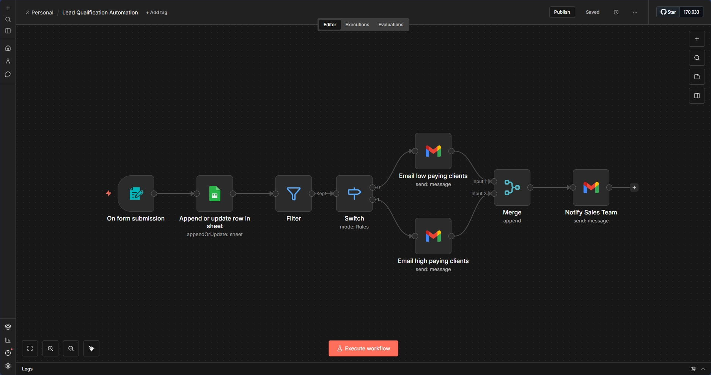

# Lead Qualification Automation



## 📋 Overview

An intelligent lead qualification system that automatically processes contact form submissions, categorizes prospects by budget, and delivers personalized responses. High-value leads receive priority treatment while the sales team stays informed of all qualified inquiries.

## ✨ Features

- **📝 Form Capture** - Collects lead information through a web form
- **📊 Automatic Logging** - Saves all submissions to Google Sheets with timestamp
- **🎯 Smart Filtering** - Filters out low-budget inquiries (under $100)
- **🔀 Budget-Based Routing** - Routes leads to different email templates:
  - **$100-1,000** - Standard acknowledgment with sales follow-up
  - **$1,000+** - Priority response with direct calendar booking
- **📧 Automated Emails** - Sends personalized responses to prospects
- **🔔 Sales Notifications** - Forwards qualified lead details to sales team
- **🔄 Duplicate Prevention** - Uses email as unique identifier to prevent duplicates

## 🔧 How It Works

```
Form Submission
    ↓
Save to Google Sheets
    ↓
Filter (Budget ≠ $0-100)
    ↓
Route by Budget
    ├── $100-1,000 → Standard Email → Notify Sales
    └── $1,000+    → Priority Email → Notify Sales
```

## 🛠️ Technologies Used

- **n8n** - Workflow automation engine
- **Google Sheets API** - Lead database and CRM
- **Gmail API** - Email communications
- **Webhooks** - Form trigger integration

## 📦 Setup Instructions

### Prerequisites
- n8n installed (locally or cloud)
- Google account with Sheets and Gmail access
- Basic understanding of n8n workflows

### Installation

1. **Import the Workflow**
   ```bash
   # In n8n interface:
   # Workflows → Import from File → Select Lead_Qualification_Automation.json
   ```

2. **Configure Google Sheets**
   - Create a new Google Sheet with columns: `First Name`, `Last Name`, `Email`, `Budget`, `Message`, `Date`, `Rejected`
   - Copy the sheet ID from the URL
   - Update the `documentId` in the workflow

3. **Set Up Credentials**
   - Add Google Sheets OAuth2 credentials
   - Add Gmail OAuth2 credentials
   - Authorize both services

4. **Update Email Addresses**
   - In "Notify Sales Team" node: Replace `sales@yourcompany.com` with your sales email
   - Update company name in email templates (currently "ABC Company")

5. **Customize Email Templates** (Optional)
   - Modify email subject lines and body text
   - Update calendar booking link (currently `https://calendly.com/yourcompany/discovery-call`)
   - Adjust budget ranges if needed

6. **Test the Workflow**
   - Use the "Execute Workflow" button
   - Submit test data through the form
   - Verify emails are sent and data is logged

7. **Activate**
   - Toggle the workflow to "Active"
   - Your form is now live and ready to receive submissions

## 🎓 What I Learned

- **Conditional Logic**: Implementing budget-based routing using Switch nodes
- **Data Transformation**: Mapping form fields to Google Sheets columns
- **API Integration**: Connecting multiple services (Sheets, Gmail) in one workflow
- **Error Handling**: Using filters to prevent unwanted data processing
- **Email Automation**: Crafting professional automated responses
- **Business Logic**: Understanding lead qualification and sales processes

## 🔄 Workflow Nodes Breakdown

| Node | Purpose |
|------|---------|
| Form Trigger | Captures form submissions via webhook |
| Append/Update Sheet | Logs leads to Google Sheets |
| Filter | Removes leads with budget < $100 |
| Switch | Routes based on budget tier |
| Email Low Paying | Sends standard acknowledgment |
| Email High Paying | Sends priority response with calendar |
| Merge | Combines both paths |
| Notify Sales | Alerts sales team of new qualified lead |

## 📊 Sample Data Flow

**Input (Form Submission):**
```json
{
  "First Name": "Sarah",
  "Last Name": "Johnson",
  "Email": "sarah.johnson@example.com",
  "Budget": "1,000+",
  "Message": "Interested in web development services"
}
```

**Output:**
- ✅ Saved to Google Sheets
- ✅ Priority email sent to Sarah with calendar link
- ✅ Sales team notified with lead details

## 🚀 Potential Enhancements

- [ ] Add SMS notifications for high-value leads
- [ ] Integrate with CRM (Salesforce, HubSpot)
- [ ] Add lead scoring based on message content
- [ ] Implement automated follow-up sequences
- [ ] Create dashboard for lead analytics
- [ ] Add timezone detection for scheduling
- [ ] Implement A/B testing for email templates

## 📝 Use Cases

This workflow is ideal for:
- **Service Agencies** - Web design, marketing, consulting firms
- **Freelancers** - Prioritizing client inquiries
- **SaaS Companies** - Qualifying demo requests
- **B2B Businesses** - Managing partnership inquiries
- **Consultants** - Filtering and routing consultation requests

## 📄 License

This project is open source and available for learning purposes.

## 🙏 Acknowledgments

Built as part of my journey learning workflow automation and business process optimization.

---

**Questions or suggestions?** Feel free to open an issue or reach out!