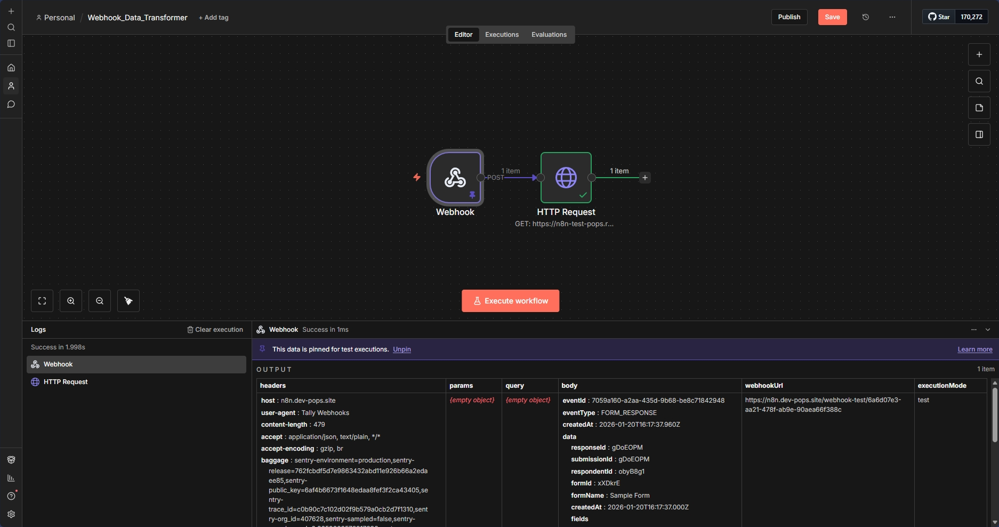

# Webhook Data Transformer



## 📋 Overview

A simple yet powerful webhook automation that receives form submissions from Tally forms, transforms the data structure, and forwards it to external services. This workflow demonstrates API integration and data mapping fundamentals.

## ✨ Features

- **📥 Webhook Receiver** - Accepts POST requests from Tally form submissions
- **🔄 Data Transformation** - Extracts and restructures form field data
- **📤 HTTP Forwarding** - Sends formatted data to external endpoints
- **🧪 Request Testing** - Uses RequestCatcher for debugging and monitoring

## 🔧 How It Works

```
Tally Form Submission (Webhook)
    ↓
Extract Name & Email from nested JSON
    ↓
HTTP POST to RequestCatcher
    ↓
Data logged for verification
```

## 🛠️ Technologies Used

- **n8n** - Workflow automation
- **Webhook** - HTTP trigger endpoint
- **Tally** - Form builder (external)
- **RequestCatcher** - Request inspection tool

## 📦 Setup Instructions

### Prerequisites
- n8n instance (local or cloud)
- Tally account (or any webhook-enabled form service)
- RequestCatcher URL (or your own endpoint)

### Installation

1. **Import the Workflow**
   ```bash
   # Import Webhook_Data_Transformer.json into n8n
   ```

2. **Configure Webhook**
   - The webhook will automatically generate a URL
   - Copy the webhook URL (e.g., `https://your-n8n.com/webhook/6a6d07e3-aa21-478f-ab9e-90aea66f388c`)

3. **Set Up Tally Form**
   - Create a form with "First Name" and "Email" fields
   - In Tally settings → Integrations → Webhooks
   - Paste your n8n webhook URL
   - Select "Send on form submission"

4. **Update HTTP Request Node**
   - Replace `https://n8n-pops.requestcatcher.com/test` with your endpoint
   - Or use RequestCatcher to create your own test URL

5. **Test the Workflow**
   - Submit a test form in Tally
   - Check RequestCatcher to see the transformed data
   - Verify Name and Email were extracted correctly

6. **Activate**
   - Set workflow to "Active"
   - Your webhook is now live!

## 🎓 What I Learned

- **Webhook Fundamentals**: Understanding HTTP POST requests and payload structures
- **JSON Navigation**: Accessing nested data structures (`$json.body.data.fields[0].value`)
- **Data Mapping**: Transforming input data to match external API requirements
- **API Integration**: Sending HTTP requests with custom body parameters
- **Debugging Techniques**: Using tools like RequestCatcher to inspect requests

## 🔄 Workflow Nodes Breakdown

| Node | Purpose |
|------|---------|
| Webhook | Receives POST requests from Tally forms |
| HTTP Request | Forwards transformed data to external endpoint |

## 📊 Sample Data Flow

**Input (Tally Webhook):**
```json
{
  "body": {
    "data": {
      "fields": [
        {
          "label": "First Name",
          "value": "John"
        },
        {
          "label": "Email",
          "value": "john.doe@gmail.com"
        }
      ]
    }
  }
}
```

**Output (HTTP Request):**
```json
{
  "Name": "John",
  "Email": "john.doe@gmail.com"
}
```

## 📝 Use Cases

This workflow is ideal for:
- **Form Integrations** - Connecting form builders to custom backends
- **Data Pipelines** - Transforming data between different systems
- **API Gateway** - Acting as a middleware for data reformatting
- **Webhook Testing** - Learning how webhooks and HTTP requests work
- **Microservices** - Building simple data transformation services


## 💡 Learning Notes

**Key Concept:** This workflow demonstrates the ETL pattern (Extract, Transform, Load):
- **Extract**: Receive data from webhook
- **Transform**: Restructure the JSON payload
- **Load**: Send to destination endpoint

**Best Practice:** Always test webhooks with tools like RequestCatcher before sending to production systems.

## 📄 License

This project is open source and available for learning purposes.